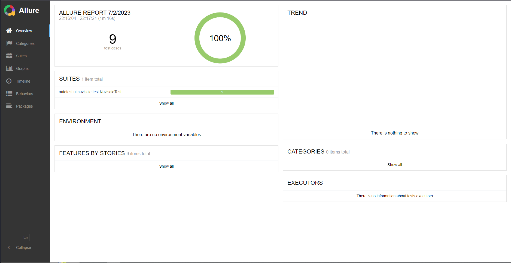
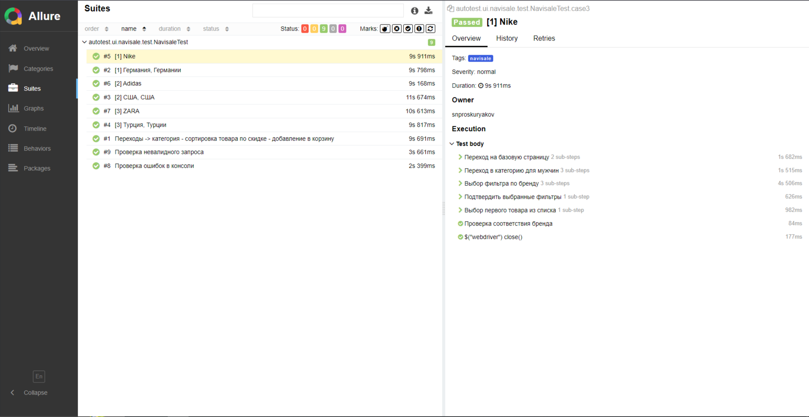
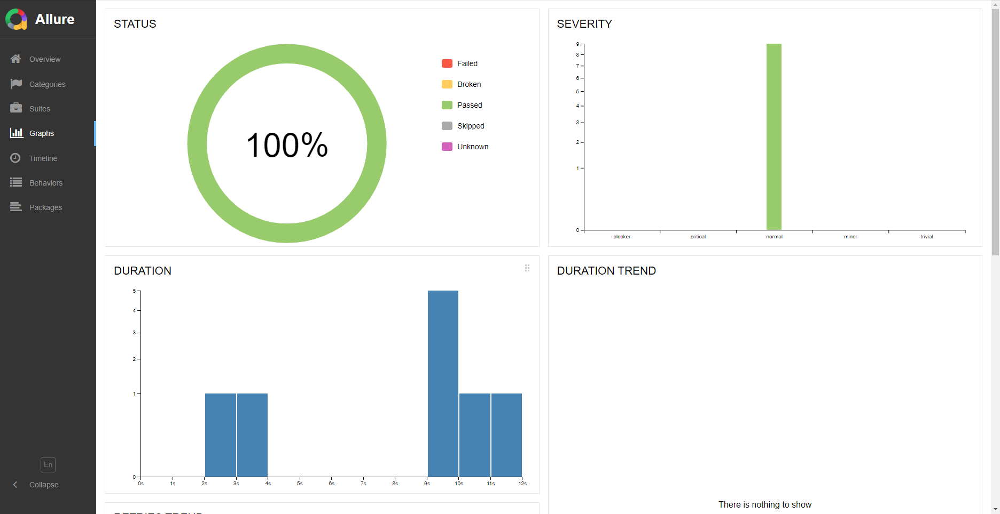

# Проект по автоматизации тестирования Navisale

## 📖:	Содержание

> ➠ [Покрытый функционал](#coffee-покрытый-функционал)
>
> ➠ [Технологический стек](#classical_building-технологический-стек)
>
> ➠ [Отчет о результатах тестирования в Allure Report](#eye_speech_bubble-главная-страница-allure-отчета)

## :coffee: Покрытый функционал

> Разработаны автотесты на <code>UI</code>.
### UI

- [x] Проверка отображения страницы поиска товаров
- [x] Отсутствие ошибок в журнале консоли страницы
- [x] Проверка фильтра товаров
- [x] Проверка ошибки "Товары отсутствуют"

## :classical_building: Технологический стек

В данном проекте автотесты написаны на <code>Java</code> с использованием <code>Selenide</code> для UI-тестов.
>
> <code>Allure Report</code> формирует отчет о запуске тестов.
>
> Для автоматизированной сборки проекта используется <code>Maven</code>.
>
> В качестве библиотеки для модульного тестирования используется <code>JUnit 5</code>.

### :eye_speech_bubble: Главная страница Allure-отчета

### ⚓  Группировка тестов по проверяемому функционалу

### 📉 Основной дашборд

